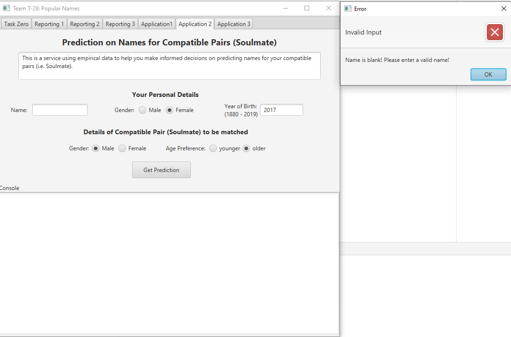
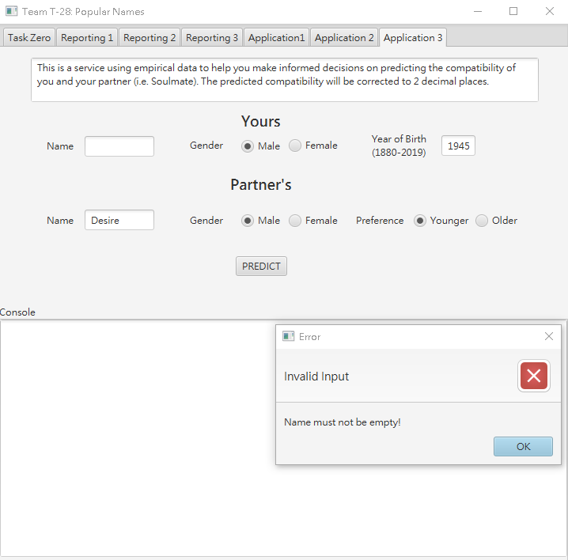

# Team T-28
> <https://github.com/Kit-p/COMP3111-Project-T28.git>

## GitHub Page
> 

---

# Members
## 1. PANG, Kit

> email: kpangaa | github: Kit-p | dev branch: kpangaa_dev

> Task 3 & Task 6

## 2. TAM, Tsz Chung

> email: tctam | github: TAMTszChung | dev branch: tctam_dev

> Task 2 & Task 5

## 3. WU, Tsz Yeung

> email: tywuab | github: tywuab | dev branch: tywuab_dev

> Task 1 & Task 4

---

# Tasks
All screenshots below can be found [here](supplementary/resources/Screenshots)!

## Task 1 (Reporting 1)
> **Description:**  
> Generate a brief report in response to the queries on the most popular names registered at birth over a given period.

> **Demonstrations:**
> 
> *Valid input with output*
> 
> 
> *Invalid input with alert (N is out of expected range)*
> 

## Task 2 (Reporting 2)
> **Description:**  
> This is a service that generate a brief report in response to the queries on the popularity of a particular name over a given period.

> **Demonstrations:**
> 
> *Valid input with output (case 1)*
> 
> 
> *Valid input with output (case 2)*
> 
> 
> *Invalid input with alert (name is blank)*
> 
> 
> *Invalid input with alert (period is out of expected range)*
> 

## Task 3 (Reporting 3)
> **Description:**  
> This is a service that generates a brief report in response to the queries 
> on identifying the names that have maintained a high level of popularity 
> within Top N over a given period.

> **Demonstrations:**
> 
> *Valid input with output (case 1)*
> 
> 
> *Valid input with output (case 2)*
> 
> 
> *Invalid input with alert (N is out of expected range)*
> 
> 
> *Invalid input with alert (N is blank)*
> 
> 
> *Invalid input with alert (year is out of expected range)*
> 
>
> *Invalid input with alert (year is out of expected range)*
> 
> 
> *Invalid input with alert (period is invalid)*
> 

## Task 4 (Application 1)
> **Description:**  
> This task will provide 2 recommended names for a child, 1 for a boy 1 for a girl based on the ranking of the names of their parents. The system will generate 2 recommended names based on the ranking of the parents’ names in their year of birth and find 2 names with the same ranks in the given vintage year.

> **Algorithm:**  
> The algorithm returns 2 recommended names for the user, 1 for a boy, 1 for a girl based on the
  the ranks of the names of the parents in their respective birth years. Then the algorithm will
  choose 2 names with the same rank as the names of the parents and return the recommended names.
  If the rank of the parents' names are too low or out of bound, the algorithm will return the lowest
  ranked names in the vintage year

> **Justification:**  
> The original NK-T4 algorithm of Universal compatibility will first compute the ranks of the parents,
  which is the rank of the parents' names' in their respective year of birth. Then it will compute a name for the boy and a name for the girl which has the same rank as the parents' names' ranks in their respective year of birth. However, the given algorithm will be unable to provide a recommendation when the ranks of the parents'
  names are too low, or when the vintage year does not have a name at that rank.
  
> Therefore, we modified the algorithm to make it return the name with the lowest rank in that year,
  if there are multiple names with the same rank, it will return the first name in that rank.

> **Demonstrations:**
> 
> *Valid input with output*
> 
> 
> *Invalid input with alert (year of birth is not a valid year)*
> 
> 
> *Invalid input with alert (vintage year is out of expected range)*
> 

## Task 5 (Application 2)
> **Description:**  
> This is a service using empirical data to help user make informed decisions on predicting names for your compatible pairs (i.e. Soulmate).

> **Algorithm:**  
> The algorithm predicts the name of the soulmate of the user by finding the name that has the closest rank to the user's 
> name rank with the preferred gender in the calculated soulmate's year of birth.
>
> The algorithm first calculates the rank of the user's name in his/her year of birth.
>
> Then, calculate the year of birth of the soulmate, if the preference is "younger", the soulmate's year of birth is (user's year of birth - 1), 
> else if the preference is "older", the soulmate's year of birth is (user's year of birth + 1).
>
> Finally, the algorithm finds the name in the soulmate's year of birth that has the same rank as the user's name rank, 
> which has the closest possible rank to the user's name rank, and returns that name.
>
> If there do not exist that has the same rank as the user's name rank, either due to the user's name is not ranked, 
> or the user's name rank is too low that there is not a name in the soulmate's year of birth with that rank, 
> the algorithm returns lowest-ranked name in the soulmate's year of birth, which has the closest possible rank with name that is not ranked.

> **Justification:**  
> This algorithm predicts the soulmate's name by finding a name in the soulmate's year of birth 
> with the closest rank to the user's name rank in the user's year of birth.
>
> This is because the rank of the name basically represents the popularity of a name in the year (as higher rank name has larger occurrence). 
> With so many possible names, it is very difficult for the name of 2 people to be of the same rank and be equally popular in their year of birth.
>
> The closer the ranks of the 2 names are, the lower the possibility is.
>
> Such rarity resembles the concept of serendipity, which we use as the criteria for predicting the name of the soulmate of the user.
>
> In addition, the soulmate's year of birth is (user's year of birth - 1) or (user's year of birth + 1) because 
> people in the same generation should have more common knowledge and interest, 
> so age difference of 1 should make 2 people a good pair.
>
> The original NK-T5 Algorithm of Universal Compatibility also uses the above principle to predicts the soulmate's name.
>
> However, if the user's name is not ranked, or the user's name rank is too low that there is not a name in the soulmate's year of birth with that rank, 
> the original algorithm uses the top-ranked name in the soulmate's year of birth as the predicted name.
> Thus, the predicted name will not have the closest rank to the user's name, but instead having the largest difference in rank and popularity. 
> This does not resemble the concept of serendipity, and the name prediction is not coherent in all cases.
> 
> Therefore, the modified algorithm returns the lowest-ranked name in the soulmate's year of birth in such case. 
> As a name that is not ranked is below the lowest-ranked name, the lowest-ranked name will have the closest rank to the not ranked name. 
> Thus, the modified algorithm will always recommend the name with the closest rank to the user's name rank, making coherent recommendations in all cases.
>
> Therefore, the modified algorithm gives justifiable and coherent predictions for the soulmate name in all cases.

> **Demonstrations:**
>
> *Valid input with output (case 1)*
> 
> 
> *Valid input with output (case 2)*
> 
> 
> *Invalid input with alert (name is blank)*
> 
> 
> *Invalid input with alert (year of birth is out of expected range)*
> 
> 
> *Invalid input with alert (age preference with given year is out of expected range)*
> 
> 
> *Invalid input with alert (age preference with given year is out of expected range)*
> 

# Task 6 (Application 3)
> **Description:**  
> This is a service using empirical data to help you make informed decisions 
> on predicting the compatibility of you and your partner (i.e. Soulmate).
> 
> The predicted compatibility will be corrected to 2 decimal places.

> **Algorithm:**  
> The algorithm computes the difference between 
> the ranks of the names of the pair in their own year, 
> and the maximum possible difference between the ranks of the names of the pair in their own year.
> 
> The ratio implies how close their ranks are and is then converted to percentage (corrected to 2 d.p.).
> 
> The percentage is the predicted compatibility of the pair.
> 
> Exception case is when any of the names of the pair is not ranked on the corresponding year, 
> the algorithm will substitute it with the lowest possible rank of the corresponding gender of the corresponding year.

> **Justification:**  
> The original NK-T6 Algorithm of Universal Compatibility computes a variation of the percentage difference, 
> which will result in values that are smaller than 0% or greater than 100%.
> 
> The modified algorithm uses the rank difference as the numerator and the maximum difference as the denominator.
> 
> Since the difference is always greater than or equal to zero, 
> and is always smaller than or equal to the maximum difference, 
> the result will always be between 0% and 100%, which is consistent with the expected output format.
> 
> The algorithm is used because we believe it is difficult for the two names of the pair to have the same rank. 
> The closer the ranks are, the lower the possibility is. Such rarity resembles the concept of serendipity, which we use as the criteria for predicting compatibility.
> 
> The reason why the algorithm substitutes the rank of names that is not ranked 
> with the lowest rank of the corresponding gender of the corresponding year, 
> is to ensure the user will always see a reasonable output (0% - 100%), 
> no matter what names the input is, so they will not be disappointed with an error. 
> Choosing the lowest possible rank is because that is the best estimate of the rank, 
> given that names that are not ranked would be rare and low on occurrence if not none.

> **Demonstrations:**
>
> *Valid input with output (case 1)*
> 
> 
> *Valid input with output (case 2)*
> 
> 
> *Invalid input with alert (name is blank)*
> 
> 
> *Invalid input with alert (age preference with given year is out of expected range)*
> 
> 
> *Invalid input with alert (age preference with given year is out of expected range)*
> 
> 
> *Invalid input with alert (year of birth is out of expected range)*
> 
> 
> *Invalid input with alert (year of birth is blank)*
> 

---

# Reports
## Test Report
The test report can be found [here](https://kit-p.github.io/COMP3111-Project-T28/supplementary/reports/tests/test/index.html)!

## Coverage Report
The coverage report can be found [here](https://kit-p.github.io/COMP3111-Project-T28/supplementary/reports/jacocoHTML/index.html)!

---

# Documentations
The documentations (generated by JavaDoc) can be found [here](https://kit-p.github.io/COMP3111-Project-T28/docs/index.html)!

---

# Supplementary Notes
The supplementary notes can be found [here](supplementary/supplementaryNotes.pdf)!